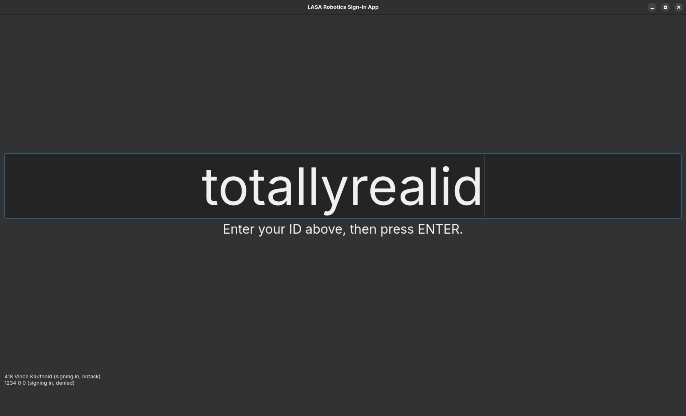

# Sign-In Application
This is the application that will run on the sign-in computer. It provides a simple interface to log sign-ins and sign-outs.

## Commands
There are some built-in commands you can enter instead of an ID to do certain things:
- Open terminal / command prompt: configurable in config.json, only really useful on Windows 
- Update & restart the program (doesn't reset the log): up
- Reset saved log file (for a new day): reset
- Close the window (doesn't reset the log): exit

## Logic
- When an ID is valid and the person is on the task list, it's added to the spreadsheet and the screen flashes green for 1 second.
- When an ID is valid but the person is NOT on the task list, it's still added to the spreadsheet, but the screen flashes blue for 3 seconds as an indicator.
- When an ID is invalid, it is NOT added to the spreadsheet, and the screen flashes red for 3 seconds.

- There's a small log at the bottom of the screen showing the past 10 entries.

- If someone has signed in in the past 5 seconds and enters their ID again, it is ignored. This is to prevent people accidentally scanning their IDs twice in a row.
- If someone has already signed in, it is assumed they are signing out (though it's not logged in the spreadsheet differently; only the message and small log show this)

## Installation
1. Use Git (`sudo apt-get install git` or download it [here](https://git-scm.com/downloads) for Windows) to clone this repository or download the source and extract it in a directory of your choice.
2.
  - If you're on Linux, `cd` into the directory, then run `./install.sh`. If it gives a permission error, give it execute permissions with `chmod +x ./install.sh`. Linux distros other than Debian are not currently supported.
  - If you're on Windows, you'll need to install [Python](https://python.org/downloads). **ONLY VERSIONS <3.12 ARE SUPPORTED BY QT.** [3.11.9](https://www.python.org/downloads/release/python-3119/) is the latest supported version with Windows support. `cd` into the directory and run `install.bat`. 
3. Through Google Cloud, create credentials and put them in `credentials.json`.
4. Create `config.json` and put the ID of the spreadsheet and password to open CMD, formatted like `{"spreadsheet_id": "YOUR_SPREADSHEET_ID", "cmd_password": "YOUR_CMD_PASSWORD"}`.

## Running
Simply run `./run.sh` on Linux, or `run.bat` on Windows. If it gives a permission error on Linux, give it execute permissions with `chmod +x ./run.sh`.

## Screenshots

